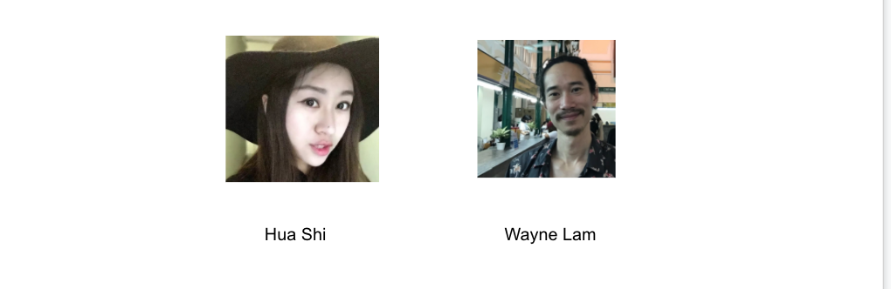
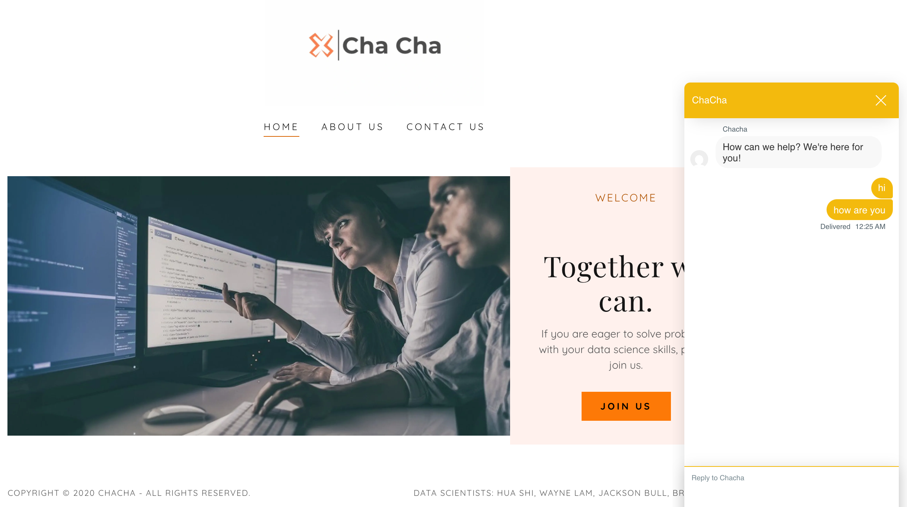
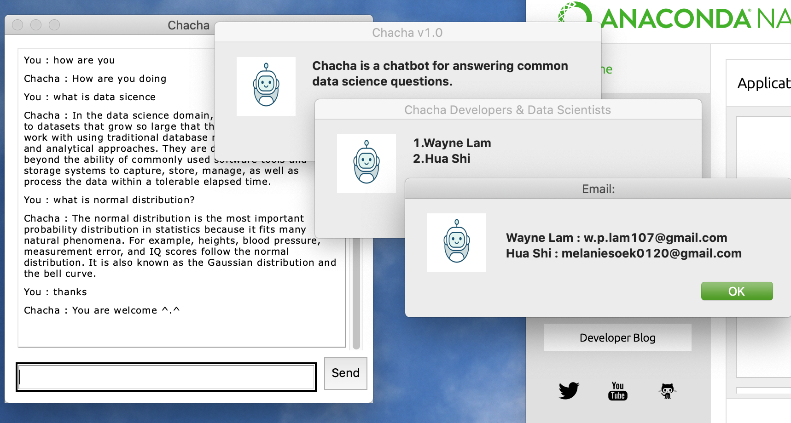
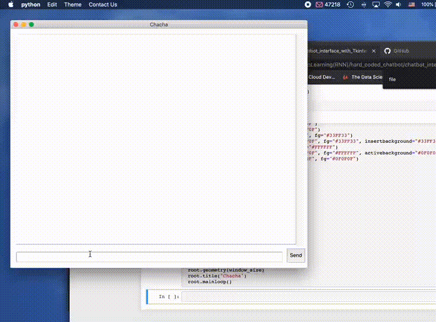
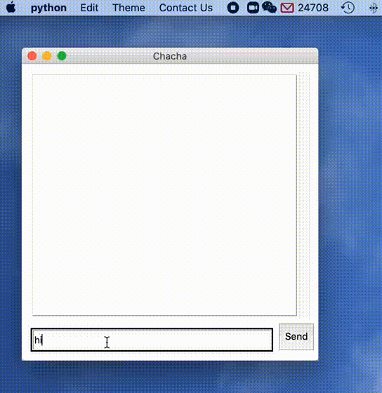

# Chatbot Project

## Team Members

## Goal
The goal of this chatbot project is to answer data science students common questions. This project contains two parts -  hard-coded part and deep learning part.
The datasets were collected from reddit API and Stack Overflow (Web Scraping). Besides, [Natural Language Processing](https://en.wikipedia.org/wiki/Natural_language_processing) (NLP) was applied in both parts. Currently, we are updating the datasets from different sources. Due to the large amount of data, we are ready to train our model on AWS & GCP. 

We will use different interfaces for our chatbot - web version and [tkinter](https://docs.python.org/3/library/tkinter.html) version.
### Web Version

### Tkinter Version (hard-coded VS Deep Learning)

# Hard-coded Chatbot
In this part we collected datasets which are definitions, concepts and fixed usages. NLP part contains tokenization, punctuation removal, stop words removal, stemming and lemmatization.  

# RNN Chatbot
The conversation for chatbot in this part will be more general. 

